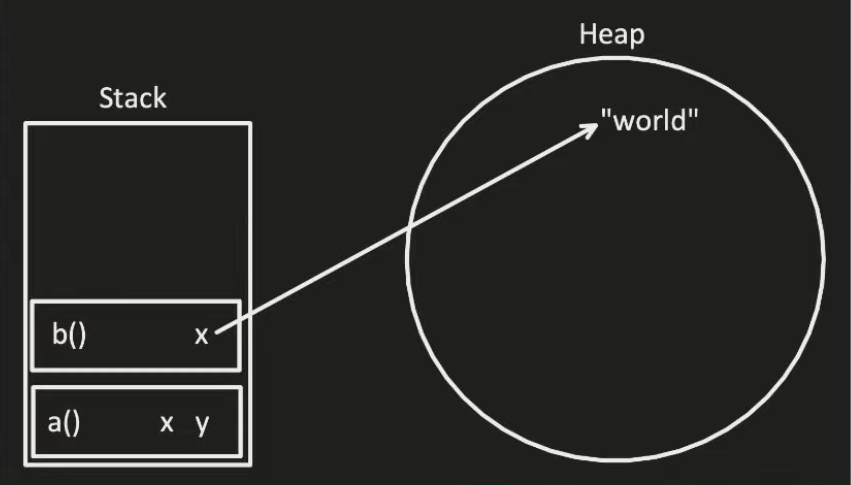

#+TITLE: Rust Language Notes
#+AUTHOR: Sujal Bajracharya

* Table of Contents :toc:
- [[#variables][Variables]]
  - [[#immutability][Immutability]]
  - [[#shadowing][Shadowing]]
- [[#data-types][Data types]]
  - [[#scalar-data-types][Scalar Data types]]
  - [[#compound-data-types][Compound Data Types]]
- [[#functions][Functions]]
- [[#control-flow][Control Flow]]
  - [[#if-else-if-else][if, else if, else]]
  - [[#loops][Loops]]
- [[#ownership][Ownership]]
  - [[#stack-and-heap][Stack and Heap]]
  - [[#ownership-rules][Ownership rules]]
  - [[#copy-move-and-clone][Copy, Move and Clone]]

* Variables
** Immutability
Variables are immutable by default in rust. They can be made mutable by using the mut keyword.
Rust also has constant variables are can't bu muted or return through a function. Constant variables can't be computed at runtime.
#+begin_src rust
let mut x: i32 = 5;
const NUMBER: u32 = 9_847_284_792;
#+end_src
** Shadowing
Shadowing is creating two immutable variables with the same name.
#+begin_src rust
let mut x: i32 = 5;
let mut x: &str = "six";
#+end_src

* Data types
Rust has 2 types of data types:
1. Scalar Data types
2. Compound Data types
** Scalar Data types
Rust has 4 scalar data types:
1. Integer
2. Floating Point Number
3. Boolean
4. Character
*** Integer
Rust defaults to unsigned 32-bit.
| Length  | Signed | Unsigned |
|---------+--------+----------|
| 8-bit   | i8     | u8       |
| 16-bit  | i16    | u16      |
| 32-bit  | i32    | u32      |
| 64-bit  | i64    | u64      |
| 128-bit | i128   | u128     |
| arch    | iarch  | uarch    |
#+begin_src rust
let a: i32 = 32_444;        //Decimal
let b: i32 = 0xff;          // Hexa Decimal
let c: i32 = 0o77;          // Octal
let d: i32 = 0b11111_00000; // Binary
let e: u8  = b'A';          // Byte (u8 only)
#+end_src
*** Floats
Rust defaults to 64-bit.
#+begin_src rust
let a: f64 = 2.0;
let b: f32 = 3.0;
#+end_src
*** Boolean
#+begin_src rust
let a: bool = true;
let b: bool = false;
#+end_src
*** Character
#+begin_src rust
let a: char = 'z';
#+end_src
** Compound Data Types
Compound data types represent a group of values.
1. Tuple
2. Array
*** Tuple
#+begin_src rust
let tup: (&str, i32) = ("XRhahelry", 30_000);
#+end_src
Get values from a tuple.
#+begin_src rust
let tup: (&str, i32) = ("XRhahelry", 30_000);

// Destructuring
let (name, num) = tup;
let name = tup.0;
#+end_src
*** Array
Arrays must have a known length and all elements must be initialized.
#+begin_src rust
let array = [1, 2, 3, 4, 5];
let array2 = [0; 3]; // [0, 0, 0]
#+end_src
* Functions
To return something from the function it must be set at the start of function definition. Semi colon is not needed for last line of a function.
#+begin_src rust
fn main() {
    function(a, b);
}

fn function(x: i32, y: i32) -> i32 {
    return x + y;
    // or
    x + y
}
#+end_src
* Control Flow
** if, else if, else
#+begin_src rust
if num < 10 {
}else if{
}else{
}
#+end_src
if else can be used inside a let statement
#+begin_src rust
let number = if condition {5} else {6};
#+end_src
** Loops
There are 3 types of loop in rust:
1. loop
2. while loop
3. for loop
*** loop
Use break to end the loop. to return a value from the loop use break like return.
#+begin_src rust
let result = loop {
    println("hello");
    break 32;
};
#+end_src
*** while
#+begin_src rust
while condition {
}
#+end_src
*** for
#+begin_src rust
let a = [1, 2, 3, 4, 5];

for element in a.iter() {
   println("{}", element);
}

for num in 1..4 {
   println("{}", num);
}
#+end_src
* Ownership
Ownership model is a way to manage memory.
| Pros                 | Cons                               |
|----------------------+------------------------------------|
| Control over memory  | Slower write time                  |
| Error free*          | (fighting with the borrow checker) |
| Faster runtime       |                                    |
| Smaller program size |                                    |
** Stack and Heap
Memory can be stored in one of two places during run time.
1. Stack
2. Heap

During runtime the program can access both the stack and heap.
| Stack                                          | Heap                                                                         |
|------------------------------------------------+------------------------------------------------------------------------------|
| Stack is fixed sized                           | Heap is unorganized                                                          |
| has stack frame for every function             | Used for dynamic variables                                                   |
| stack frame stores the info of local variables | for every variable in heap a pointer to that variable is stored in the stack |
| Faster                                         | Slower as you have to follow the pointer form the stack                      |
** Ownership rules
1. Each value in rust has a variable called its owner.
2. There can only be one owner at a time.
3. When the owner goes out of scope the value will be dropped.
#+begin_src rust
fn main() {
    {
        let s: &str = "hello";// s in scope
        let s: String = String::from("hello");// s in scope
    }// s out of scope
}
#+end_src
** Copy, Move and Clone
*** Copy, Move
When copying strings the original variable is removed when its values has been copied or it is moved to the new variable.
#+begin_src rust
// The string is moved to s2 and s1 is invalidated
let s1 = String::from("XRhahelry");
let s2 = s1; // Shallow copy a.k.a move
println!("{}", s1); // Error: s1 is invalid
#+end_src
*** Clone
Clone is to store the duplicate of the value of one variable in another.
#+begin_src rust
let s1 = String::from("XRhahelry");
let s2 = s1.clone();
#+end_src
